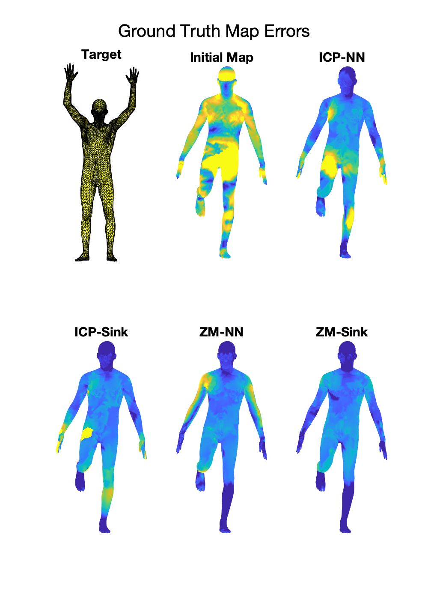

# Fast-Sinkhorn-Filters

This is a sample demo-code for Fast Sinkhorn Filters - Using Matrix Scaling for Non-Rigid Shape Correspondence with Functional Maps from CVPR 2021. 


## Main Functions

```
[S,T12,T21] = fast_sinkhorn_filter(KTar,KSrc,options)

%{
***Input***
(1.) KSrc -- a M X K Matrix of Features/Aligned Basis/Embedding in Source Shape with M Points and
K Features
(2.) KTar -- a N X K Matrix of Features/Aligned Basis/Embedding in Target Shape with N Points and
K Features
(3.) iter -- number of matrix scaling iterations desired (~ 10-50)

***Output*** 
(1.) S -- The M X N doubly stochastic matrix after matrix scaling 
(2.) T12 -- pointwise forward map, i.e. Source(Src) to Target(Tar) 
(3.) T21 -- pointwise backward map, i.e. Target(Tar) to Source(Src)

***Parameters***
An options struct with the following
(1.) p -- (power of the distance for assignment matrix) - default set to 1
(2.) knn -- number of nearest neighbors for sparsifying kernel
(3.) distmax -- factor for choosing lambda, default value 200 as per https://marcocuturi.net/SI.html
(4.) maxiter -- number of sinkhorn iterations desired
(5.) kernel_type -- 'full' or 'sparse' depending on nature of kernel
desired. Choose 'sparse' for faster mode. 

***Additional Comments*** 
You can replace the knnsearch in this script with a possibly faster
k-nearest neighbor implementation for improved performance
%}
```

## Comments

The script demo.m runs the Fast Sinkhorn Filter with 2 experiments

  - A pointwise conversion using a ground-truth *Adjoint Map* operator (which we prove in the paper to be optimal for transferring delta functions in order to establish a pointwise correspondence from a functional representation) using the nearest neighbor and our fast sinkhorn filter. We evaluate various geometric and functional metrics like: gt-error, bijectivity, spectral chamfer distance etc. as a function of the spectral basis size.

  
  - Comparing the original and *Sinkhornized* versions of **ICP** and **Zoomout** refinement algorithms. We show the ground truth error curves and also visualize the error map on ths source surface:
   
 


